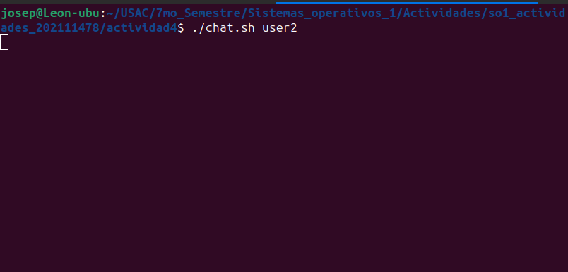
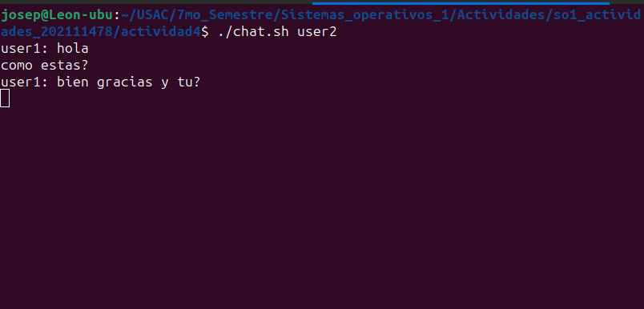

<b>
Jose David Panaza Batres 
202111478 
Sistemas Operativos 1
</b>
<h1>

Actividad 4

 
</h1>

Los named pipes, o tuberias con nombre, son un mecanismo de comunicación interprocesos en sistemas operativos Unix. Son un tipo de archivo que proporciona una forma de comunicación bidireccional entre procesos. 

Se cuentan con dos archivos, los cuales son create_pipes, este sirve para crear las named pipes, estas tiene un nombre fijo el cual es user1_to_user2 y viceversa, el archivo verifica si ya se ha creado anteriormente, y si no lo crea.

En el archivo del chat se verifica si hubo una entrada, la verifica que cumpla con el nombre de user1 o user2 para poder definir correctamente los nombre de las pipes.

Una se llama My_pipe y la otra other_pipe. Se esta leyendo constatemente lo que la otra pipe esta mandando.

Aparte en un ciclo se muestra lo que leyo del pipe, hasta que usuario se salga del chat.

Para ejecutar el chat, en la terminal se crean las pipes y se ejecutan los chats:

Aqui se queda esperando por los mensajes:

Asi interactua con el chat:

