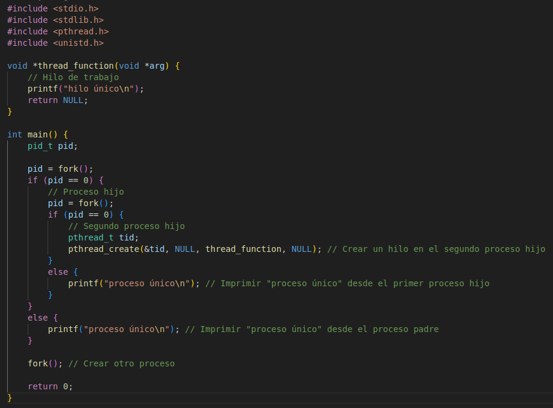
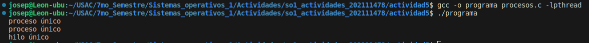

<b>
Jose David Panaza Batres 
202111478 
Sistemas Operativos 1
</b>
<h1>

Actividad 5

 
</h1>

a. ¿Cuántos procesos únicos son creados?
<h4>Se crean 2 procesos únicos</h4>

b. ¿Cuántos hilos únicos son creados?
<h4> Se crea 1 hilo único </h4>

<h2> Codigo Completo </h2>

<h2> Output </h2>

